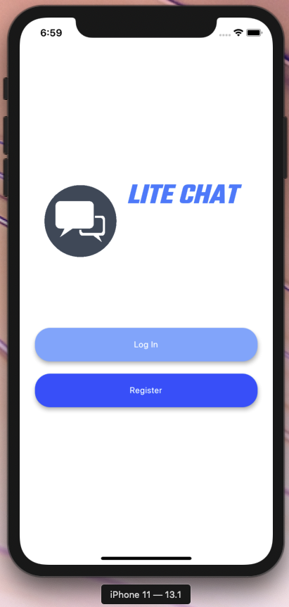
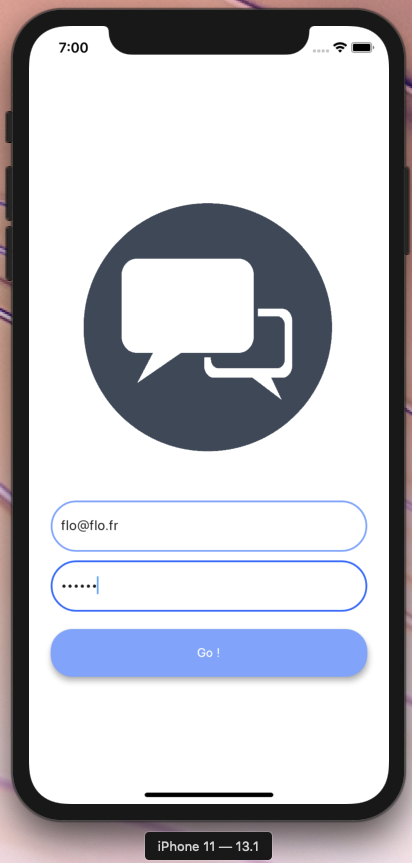
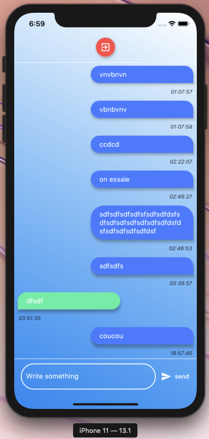

# Lite Chat

Simple Chat App built in Flutter

- My primary purpose was to build widget from scratch
- Integrating more POO concepts into my source code
- Mastering animations
- Mastering layout
- Mastering mixins and streams

## Getting Started

Be sure to have Flutter and Dart installed on your system!

### Installing

Update the pub!

## Deployment

Run IOS/ANDROID simulator/emulator

  

## Built With

* [Flutter](http://www.dropwizard.io/1.0.2/docs/) - The framework used
* [Dart](https://dart.dev/) - The SDK
* [Pub.dev](https://pub.dev/) - Packages
* [Firebase](https://firebase.google.com/) - API
* [IntelliJ Ultimate](https://www.jetbrains.com/fr-fr/idea/) - API

## Versioning

1.0

## Authors

* **Florian Gustin @Flow2dot0** - [Linkedin](https://www.linkedin.com/in/florian-gustin-26b22b171/)
